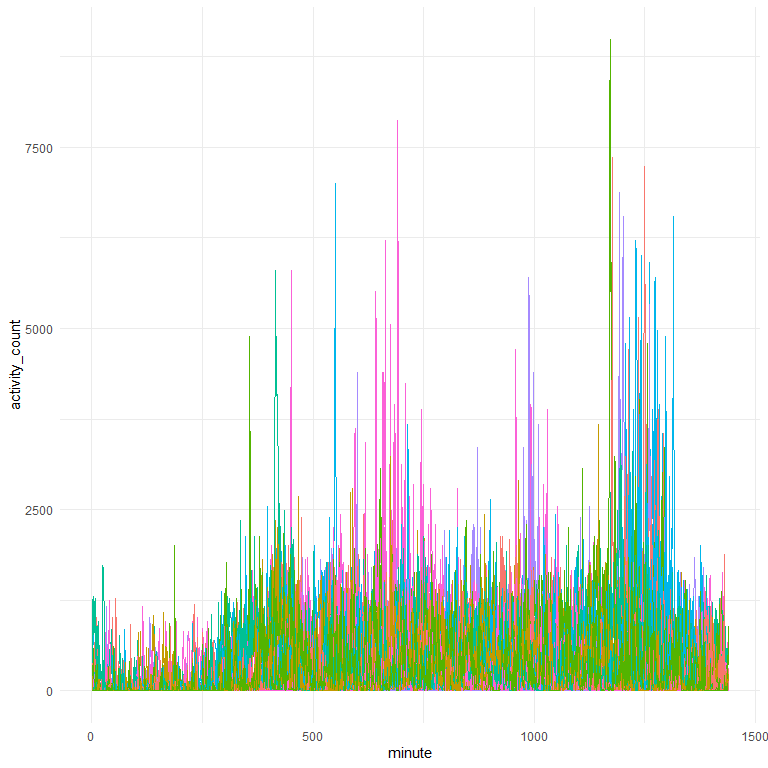
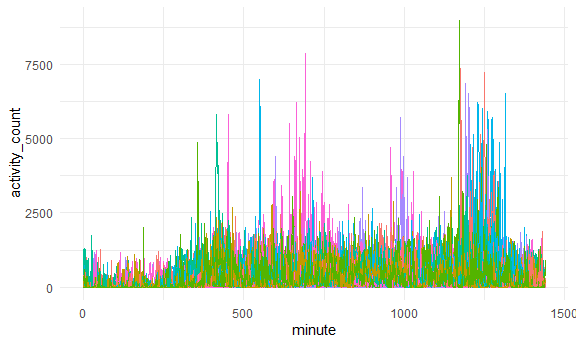
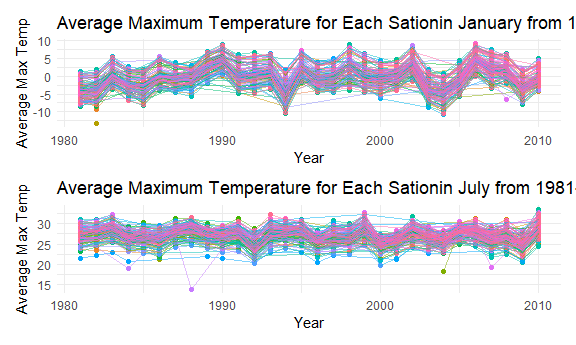
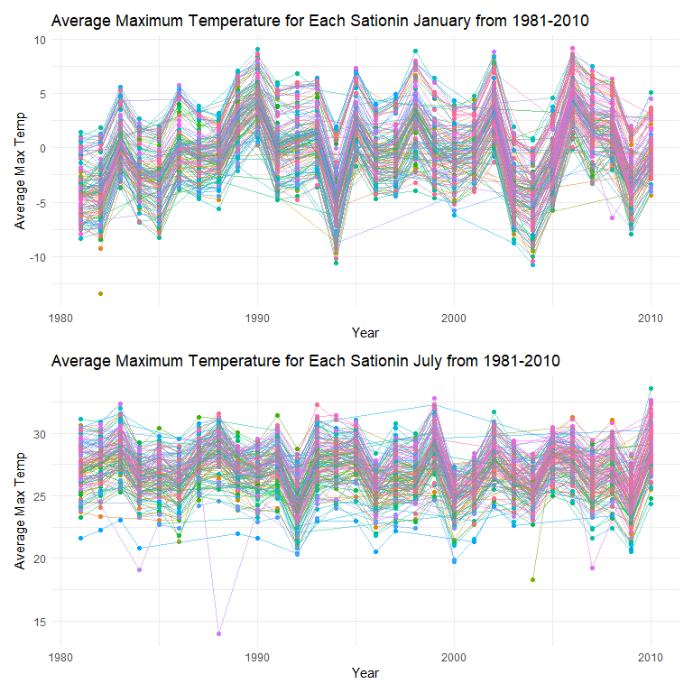

Homework 3 solutions
================
Zichen Shu

### Problem 1

``` r
data("instacart")
```

The dataset contains 1384617 rows and 15 columns.

How many aisles, and which are most item from?

``` r
instacart %>% 
  count(aisle) %>% 
  arrange(desc(n))
```

    ## # A tibble: 134 x 2
    ##    aisle                              n
    ##    <chr>                          <int>
    ##  1 fresh vegetables              150609
    ##  2 fresh fruits                  150473
    ##  3 packaged vegetables fruits     78493
    ##  4 yogurt                         55240
    ##  5 packaged cheese                41699
    ##  6 water seltzer sparkling water  36617
    ##  7 milk                           32644
    ##  8 chips pretzels                 31269
    ##  9 soy lactosefree                26240
    ## 10 bread                          23635
    ## # ... with 124 more rows

Let’s make a plot

``` r
instacart %>% 
  count(aisle) %>% 
  filter(n > 10000) %>% 
  mutate(
    aisle = factor(aisle),
    aisle = fct_reorder(aisle, n)
  ) %>% 
  ggplot(aes(x = aisle, y = n)) +
  geom_point() +
  theme(axis.text.x = element_text(angle = 90, vjust = 0.5, hjust = 1))
```


Let’s make a table\!

``` r
instacart %>% 
  filter(aisle %in% c("baking ingredients", "dog food care", "packaged vegetables fruits")) %>% 
  group_by(aisle) %>% 
  count(product_name) %>% 
  mutate(rank = min_rank(desc(n))) %>% 
  filter(rank < 4) %>% 
  arrange(aisle, rank) %>% 
  knitr::kable()
```

| aisle                      | product\_name                                 |    n | rank |
| :------------------------- | :-------------------------------------------- | ---: | ---: |
| baking ingredients         | Light Brown Sugar                             |  499 |    1 |
| baking ingredients         | Pure Baking Soda                              |  387 |    2 |
| baking ingredients         | Cane Sugar                                    |  336 |    3 |
| dog food care              | Snack Sticks Chicken & Rice Recipe Dog Treats |   30 |    1 |
| dog food care              | Organix Chicken & Brown Rice Recipe           |   28 |    2 |
| dog food care              | Small Dog Biscuits                            |   26 |    3 |
| packaged vegetables fruits | Organic Baby Spinach                          | 9784 |    1 |
| packaged vegetables fruits | Organic Raspberries                           | 5546 |    2 |
| packaged vegetables fruits | Organic Blueberries                           | 4966 |    3 |

Apples vs ice cream

``` r
instacart %>% 
  filter(product_name %in% c("Pink Lady Apples", "Coffee Ice Cream")) %>% 
  group_by(product_name, order_dow) %>% 
  summarize(mean_hour = mean(order_hour_of_day)) %>% 
  pivot_wider(
    names_from = order_dow,
    values_from = mean_hour
  )
```

    ## `summarise()` regrouping output by 'product_name' (override with `.groups` argument)

    ## # A tibble: 2 x 8
    ## # Groups:   product_name [2]
    ##   product_name       `0`   `1`   `2`   `3`   `4`   `5`   `6`
    ##   <chr>            <dbl> <dbl> <dbl> <dbl> <dbl> <dbl> <dbl>
    ## 1 Coffee Ice Cream  13.8  14.3  15.4  15.3  15.2  12.3  13.8
    ## 2 Pink Lady Apples  13.4  11.4  11.7  14.2  11.6  12.8  11.9

### Problem 2

``` r
accel_data = 
  read.csv("./accel_data.csv") %>% 
  janitor::clean_names() %>% 
  pivot_longer(activity_1:activity_1440, 
               names_to = "minute", 
               names_prefix = "activity_", 
               values_to = "activity_count") %>%
  mutate(
    weekday_or_weekend = case_when(day == "Monday" ~ "weekday", day == "Tuesday" ~ "weekday", day == "Wednesday" ~ "weekday", day == "Thursday" ~ "weekday", day == "Friday" ~ "weekday", day == "Saturday" ~ "weekend",day == "Sunday" ~ "weekend"),
    day = forcats::fct_relevel(day, c("Monday","Tuesday","Wednesday","Thursday", "Friday", "Saturday","Sunday")),
    minute = as.double(minute))
```

``` r
accel_data %>% 
  group_by(week, day) %>% 
  summarize(activity_day = sum(activity_count)) %>% 
  pivot_wider(names_from = week, values_from = activity_day) %>% 
  knitr::kable(digits = 1)
```

| day       |        1 |      2 |      3 |      4 |      5 |
| :-------- | -------: | -----: | -----: | -----: | -----: |
| Monday    |  78828.1 | 295431 | 685910 | 409450 | 389080 |
| Tuesday   | 307094.2 | 423245 | 381507 | 319568 | 367824 |
| Wednesday | 340115.0 | 440962 | 468869 | 434460 | 445366 |
| Thursday  | 355923.6 | 474048 | 371230 | 340291 | 549658 |
| Friday    | 480542.6 | 568839 | 467420 | 154049 | 620860 |
| Saturday  | 376254.0 | 607175 | 382928 |   1440 |   1440 |
| Sunday    | 631105.0 | 422018 | 467052 | 260617 | 138421 |

``` r
accel_data_hour = 
  accel_data %>% 
  mutate(hour = (minute - 1) %/%60) %>% 
  group_by(day_id, day, hour) %>% 
  summarize(hour_activity = sum(activity_count))

accel_data_hour %>% 
  ggplot(aes(x = hour, y = hour_activity, group = day_id)) +
  geom_line(aes(colour = day ))
```



``` r
accel_data %>% 
  ggplot(aes(x = minute, y = activity_count, group = day_id)) +
  geom_line(aes(colour = day))
```



### Problem 3

``` r
data("ny_noaa")

ny_noaa = ny_noaa %>%  
  separate(date, c("year", "month", "day")) %>% 
  mutate(across(year:tmin,as.numeric),
         tmax = tmax / 10,
         tmin = tmin / 10)

ny_noaa %>% 
  group_by(snow) %>% 
  summarize(n_obs = n())
```

    ## `summarise()` ungrouping output (override with `.groups` argument)

    ## # A tibble: 282 x 2
    ##     snow   n_obs
    ##    <dbl>   <int>
    ##  1   -13       1
    ##  2     0 2008508
    ##  3     3    8790
    ##  4     5    9748
    ##  5     8    9962
    ##  6    10    5106
    ##  7    13   23095
    ##  8    15    3672
    ##  9    18    3226
    ## 10    20    4797
    ## # ... with 272 more rows

``` r
jan_plot =
  ny_noaa %>% 
  filter(month == 1) %>% 
  group_by(year, id) %>% 
  summarize(avg_tmax = mean(tmax)) %>% 
  drop_na() %>% 
  mutate(rank  = min_rank(desc(avg_tmax))) %>% 
  ggplot(aes(x = year, y = avg_tmax, color = id)) + 
  geom_point() +
  geom_path(alpha = 0.5)+
  theme(legend.position = 'none')+
  labs(title = "Average Maximum Temperature for Each Sationin January from 1981-2010", x = "Year", y = "Average Max Temp")

july_plot = 
  ny_noaa %>% 
  filter(month == 7) %>% 
  group_by(year, id) %>% 
  summarize(avg_tmax = mean(tmax)) %>% 
  drop_na() %>% 
  mutate(rank  = min_rank(desc(avg_tmax))) %>% 
  ggplot(aes(x = year, y = avg_tmax, color = id)) + 
  geom_point() +
  geom_path(alpha = 0.5)+
  theme(legend.position = 'none')+
  labs(title = "Average Maximum Temperature for Each Sationin July from 1981-2010", x = "Year", y = "Average Max Temp")

jan_plot / july_plot
```



``` r
tmax_tmin_plt = 
  ny_noaa %>% 
  ggplot(aes(x = tmin, y = tmax, color = id)) +
  geom_hex()+
  theme(legend.position = "none")

snowfall_plt =
  ny_noaa %>%
  filter(between(snow,0,100), !is.na(snow)) %>% 
  ggplot(aes(x = year)) +
  geom_violin(aes(y = snow, group = as.factor(year), alpha = 0.2)) +
  theme( axis.text.x = element_text(angle = 90, vjust = 0.5, size = 8, hjust = 1)) +
  scale_y_continuous(trans = "log", breaks = c(5, 15,40, 100))+
  scale_x_continuous(breaks = seq(1981,2010,1))

tmax_tmin_plt / snowfall_plt + plot_layout(guides = 'collect',widths = 8, heights = 16)
```


